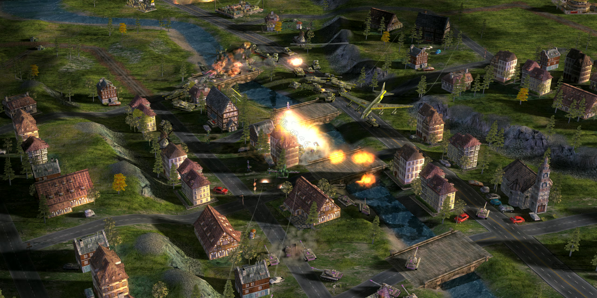
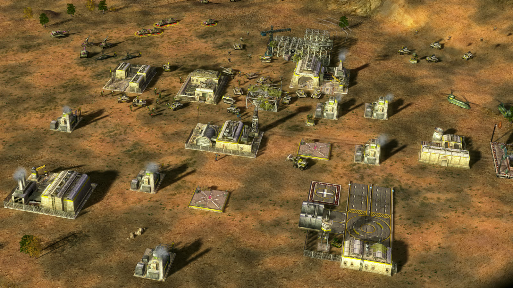
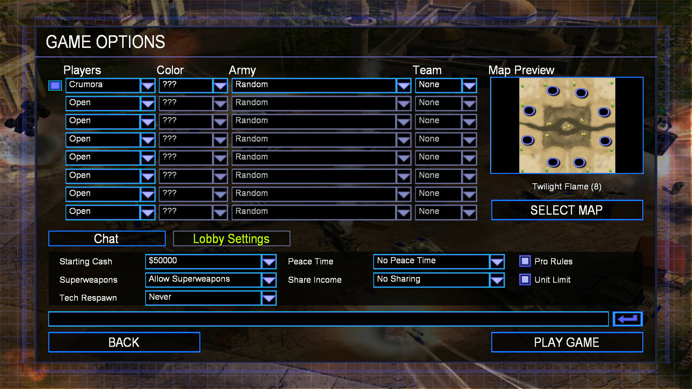
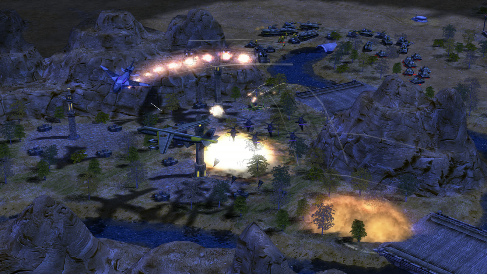
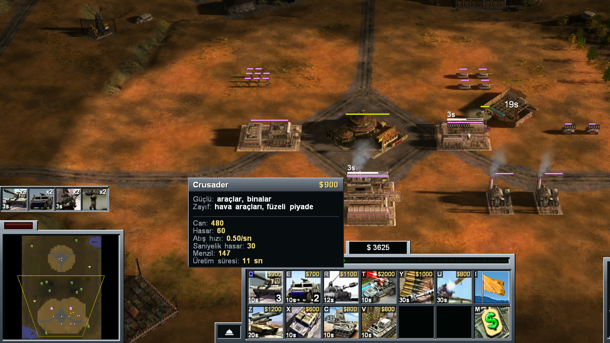

<div align="center">

# Zero Hour Reforged

Command & Conquer: Generals Zero Hour, rebuilt from the source EA opened and played as a game again.<br>
64-bit, on Windows, macOS and Linux.



[](https://github.com/olcayseygan/CnCGeneralsZH-Reforged/releases/latest)
[](https://github.com/olcayseygan/CnCGeneralsZH-Reforged/commits/main)
[](https://github.com/olcayseygan/CnCGeneralsZH-Reforged/stargazers)
[](LICENSE.md)


[zerohour.gg](https://zerohour.gg) · [Play it](#play-it) · [Every change](CHANGELOG.md) · [Build it](#build-it) · [How it is tested](#how-it-is-tested) · [Help out](#help-out) · [Discussions](https://github.com/olcayseygan/CnCGeneralsZH-Reforged/discussions)

</div>

---

EA published the source of Generals and Zero Hour in February 2025, for preservation. The game itself
never left the shelf: it is still sold, and it still runs on Steam.

Reforged is that source worked on as a game. About 580 engine source files were ported to Visual
Studio 2022 and to 64-bit, and in October 2026 the same tree learned SDL3, for Macs and Linux. Around sixty bugs that EA shipped in 2003
were found and fixed, most of them by a test before anyone read the code. The computer opponent builds
a base now. It never could.

One balance pass went in, measured with 528 staged fights a round: defences no longer die cheaper
than they cost, and the Dragon Tank, Quad Cannon, Paladin and Rocket Buggy were brought into line. The
changelog has every number behind it.

No game data ships here. You need your own copy of Zero Hour.

## Where it runs

| Platform | Draws through | Where it stands |
|:--|:--|:--|
| Windows x64 | Direct3D 11, or Direct3D 9 with `-d3d9` | the build the launcher installs |
| Windows ARM64 | the same, with the port's own texture loader in place of `d3dx9_43.dll`, which has no ARM64 build | builds; the same code forced on x64 draws what x64 draws, and it has not yet run on an ARM64 machine |
| macOS, Apple silicon | Metal, through SDL3 | playable, as `Zero Hour Reforged.app` (ad-hoc signed, not notarised) |
| macOS, Intel | Metal, through SDL3 | builds and runs |
| Linux x86_64 and the Steam Deck | Vulkan, through SDL3 | playable; makes an AppImage, `.deb`, `.rpm`, Arch package and Flatpak, none of them carrying EA's files |
| Linux arm64 | Vulkan, through SDL3 | builds and passes ctest, no package yet |

None of it runs under Wine or Proton. A replay recorded on a Mac plays back on Linux and on Windows
to the same checksum, and a Mac and a Linux PC have played a LAN match without once disagreeing.

## Then and now

| | The source EA released | Reforged |
|:--|:--|:--|
| Program | 32-bit, stalls and dies past 4 GB | 64-bit, no ceiling |
| Frame rate | the picture waits on the game's clock | uncapped, and the rules keep their own |
| Worst logic turn | `2,976 ms` | `243 ms` |
| A 23-cell route | `55,000` cells searched in `256 ms` | `10,000` cells in `25 ms` |
| Route searching over a match | `11.8 s` | `1.6 s` |
| A screen of fire and smoke | 459 draw batches, `11.6 ms` a frame | 177 batches, `6.7 ms` |
| Smoke and fire sprites on screen | the rest silently dropped past about 16,000 | all 101,000 of a test drawn, `8.3 ms` a frame |
| Skirmish opponent | urgent orders and one power plant | builds, scouts, expands, steals tanks and retreats |
| A tank told to stop | halts on the spot | rolls 12 units on its brakes |
| A kill's veterancy | all of it to the last shot | shared by damage done in the last ten seconds |
| Base game textures | Zero Hour's downscaled copies | 481 originals at four times the resolution |
| Infantry shadows | a flat blob | cast from the pose |
| Language | English | English, Türkçe or Deutsch |
| A crash | silence | a report with file and line, sent by the launcher |

## What a match feels like now

### An opponent that plays by your rules

One wrong value kept the skirmish AI building only what its script marked urgent, plus a single power
plant. Every skirmish played against this code since 2003 was against an opponent that could not
build a base. It builds one now, and keeps its supply trucks working when a pile runs dry instead of
parking them beside it.

It no longer cheats to do it. The AI used to auto-target through the fog of war and read your start
position straight off the lobby. Now it scouts, with one cheap
unit touring the start positions for the whole match, and counts only what it has seen. It walks a
rifleman into oil derricks instead of shelling them. A GLA computer keeps a hijacker on call for the
first of your vehicles that comes within walking distance.

Easy, Medium and Hard differ in what the computer is allowed to decide. No level gets extra money,
cheaper units, faster building or longer sight. Measured over 32 headless matches with the seats
swapped both ways, Hard beats Easy 15-0.



### Vehicles that drive and soldiers that walk

A Crusader used to reach top speed in a thirtieth of a second and stop dead the frame it was told
to. Every vehicle now picks up speed over about a second and brakes for the end of its
move before it gets there. Sent a short way behind itself, a tank backs up instead of spinning on the
spot, and a Humvee sent further does a three-point turn.

Turrets keep firing on the move. A Technical driving past four Troop Crawlers hit them twice; it now
hits them 11 times, as fast as it fires standing still. A running Ranger sent back the way he came
plants his feet and pivots, where he used to slide backwards past his own nose.

Groups travel as a crowd. Each unit holds its own line across the road and pulls round something
slower in front when there is room, so a column no longer queues for a mile behind one damaged truck. Long moves stopped hitching once EA's coarse route search,
which never ran, finally did its job.

### Veterancy for everyone who fought

Two Crusaders could grind an Overlord down to a sliver and a passing Humvee's rocket took every point
of it. The killing blow earns a quarter now, and the rest is shared among everything that hurt the
target in the last ten seconds, by how much health each one took off. Healing earns too.

### A command bar in the middle

The command bar is one console in the middle of the bottom edge, its radar taller than before and the
power bar lying over the build grid. Your general's powers grow out of its right end. The match clock
hangs from the top with your money under it. A superweapon built, charged or fired anywhere on the
map flashes its name under the clock in big letters, yours in white and an enemy's in red.

Left selects and right orders. A right drag scrolls the map the way it did in 2003. Shift on a build
button queues five, Ctrl twenty. Hold Tab for a scoreboard; press the key above it for a console with
a trainer panel for campaign and skirmish. HUD Size grows the whole console for a big screen read from
the sofa.

### Network games the host sets up

The lobby has a settings page. Peace time runs three, five, ten or fifteen minutes. The unit limit
shares 840 units between the players. Superweapons can be limited to one or banned outright, and Pro
Rules takes a fixed list of units and tricks out of every network match. Your ally's mouse shows on
your map as a pool of their colour with their name on it.

Two separate PCs have played each other over LAN. On a single machine, two copies of the game can
play each other through the LAN screen, which is how every network change here gets tested.



### A picture that holds up

The game draws through Direct3D 11 by default, with glow and edge smoothing over the battlefield
only, so the lettering on the command bar is never blurred. `-d3d9` brings back the old renderer.

Shadows soften as the thing casting them leaves the ground, so a helicopter's spreads and pales as it
climbs. Soldiers cast theirs from their pose and all 128 tree types cast theirs. Eighty-nine kinds of
explosion light the ground around them, and fires light the smoke over them. The pools on Golden
Oasis hold their palms upside down. The ground is drawn at twice the detail, with relief that follows the
map's own sun.



Classic Graphics, at the top of the Graphics page, puts the 2003 look back in one click. Text grows
with the monitor, and on an ultrawide the view opens sideways, so a wider screen shows more
battlefield.

### Türkçe and Deutsch

Options > Gameplay > Language. Pick Türkçe and the menus, the command bar, briefings, tooltips and
the credits come to 3,853 lines, written against one glossary of more than 1,400 terms. Deutsch is
3,848 lines. Every one-key shortcut has its own letter inside its own name in both. Voices and videos
stay as your install has them, so two players in one match can read it in two languages.



### On a Mac, on Linux and on the Steam Deck

The first start finds your game. It looks in your Steam libraries, `~/Games`, `/Applications`, and
CrossOver and Whisky bottles, and asks for the folder only when it comes up empty. The Flatpak has
played a full check match on a Steam Deck. A match between Windows and a Mac has not been played yet.

> [!NOTE]
> [CHANGELOG.md](CHANGELOG.md) is the whole record: every change with the numbers behind it, and the
> work that was tried and taken back out.

## Play it

### Windows

1. Have Zero Hour installed from Steam or the EA app.
2. Download the Reforged launcher from [zerohour.gg](https://zerohour.gg) and run it. The installer
   is not code signed, so Windows SmartScreen asks once before it starts.
3. The launcher finds your Zero Hour folder and lists every file it is about to write before it writes
   any. Each file it replaces is backed up first. Press Install, then Play.

The launcher carries no game files of its own. It downloads the build and checks every file against
a signed list, then keeps the game and itself up to date. A Steam copy still starts
through Steam. Uninstall on the launcher's settings page puts back the files your game had before.
When the game crashes, the launcher sends the report without asking you for anything.

### macOS and Linux

There is no launcher for these yet, so the game is built from this repository with one command (see
[Build it](#build-it)) and pointed at the Zero Hour you already have installed. The folder it wants is
the one holding `INIZH.big`, with the original Generals inside it as `ZH_Generals/` or beside it,
because Zero Hour mounts both. Saves and replays go to
`~/Library/Application Support/Command and Conquer Generals Zero Hour Data` on a Mac and
`~/.local/share/Command and Conquer Generals Zero Hour Data` on Linux.

The upscaled art has no download there. Copy the `Reforged*.big` files into `ReforgedArt/` in that
folder by hand, or play at the original textures.

<details>
<summary>Settings the options screen does not show</summary>

<br>

Almost everything is on the seven pages of the options screen. These still live only in
`Options.ini`, in your Zero Hour Data folder.

| Line | What it does |
|:--|:--|
| `ShowAllyCursors = no` | stops sending your mouse position to allies and stops drawing theirs |
| `EdgeScrollInWindowedMode = yes` | scrolls at the screen edge in a window too |

On the command line, `-d3d9` starts the old renderer and `-dx11post off` gives the Direct3D 11 picture
without its finishing passes. `-nologo` skips the EA logo and `-novideo` every movie, and `-loadsave
<name>` opens a save game the way `-replay` opens a replay.

</details>

---

## Build it

Each platform builds from a fresh clone with one command. It fetches what EA stripped and what GitHub
will not hold, configures, builds Release and leaves a game you can start. Put `test` after the
configuration to run the tests too, as in `./build-linux.sh Release test`.

| Platform | Command | Install first | Your Zero Hour files |
|:--|:--|:--|:--|
| Windows x64 | `build.bat` | Visual Studio 2022 with the Desktop C++ workload | the `*.big` next to `GeneralsMD/Run/generals.exe`, the base game's in `Run/ZH_Generals/` |
| Windows ARM64 | `build.bat` on an ARM64 machine, or `windows-ci.ps1 -Platform ARM64` on x64 (into `build-arm64`) | the same, with the ARM64 build tools | as x64 |
| macOS | `./build-macos.sh` | the Xcode command line tools, then `brew install cmake ninja` | left where they are installed; `build-mac/Zero Hour Reforged.app` finds them |
| Linux | `./build-linux.sh` | a C++ compiler, CMake, Ninja and the X11, Wayland, EGL and Vulkan headers SDL3 builds against; the script prints the apt, dnf or pacman line for anything missing | left where they are installed; `build-linux/ZeroHourReforged/bin/generals` finds them |

All four take the same arguments:

```console
build.bat                    :: Release
build.bat Debug              :: another configuration (Release, RelWithDebInfo, Debug)
build.bat Release test       :: and run ctest
build.bat Release generals   :: just the game
build.bat clean              :: throw the build tree away first
```

64-bit only. The 32-bit build and the last of the inline assembly went in September 2026, and
`-A Win32` is now a configure error.

<details>
<summary>Windows in detail</summary>

<br>

Double-click `build.bat`. On a clone that has never been built it finds cmake, fetches what EA
stripped, configures, builds, and copies the exe and the five FFmpeg DLLs into `GeneralsMD/Run/`,
which is where the game data is and the only place the game starts. Three minutes on a 2024 desktop.

Visual Studio 2022 with the Desktop C++ workload is the one prerequisite. It brings ATL, which
`PreRTS.h` needs; a Build Tools install needs the `Microsoft.VisualStudio.Component.VC.ATL` component
added. To run the game and its tests, the machine needs the DirectX End-User Runtime (June 2010) for
`d3dx9_43.dll`: Microsoft's full `directx_Jun2010_redist.exe`, because winget's `Microsoft.DirectX`
installs nothing.

What `build.bat` fetches into the places the repository leaves empty: zlib 1.1.4, LZH-Light 1.0, a
minimal DirectX 8 SDK, the GameSpy SDK, and the fork's own upscaled art from this repository's
`art-latest` release, checked against the sha256 in its `art.json`. Running it again costs a directory
check per library. STLport, the 3ds Max 4 SDK, NVASM and SafeDisc are not needed. Neither are the Miles
and Bink SDKs: sound and video are compiled into the exe over XAudio2 and FFmpeg, and the retail
`mss32.dll` and `BINKW32.DLL` are 32-bit images a 64-bit process cannot load anyway.

A machine that needs another cmake, generator or build folder puts its own `set` lines in
`build.local.bat` beside `build.bat`. It is git-ignored and read right after the defaults.

`windows-ci.ps1` is the whole Windows check in one command: build, ctest, the GPU tests in the desktop
session, and the replay CRCs.

The steps underneath, for when one of them is what you want:

```console
cmake -S GeneralsMD/Code -B build64 -G "Visual Studio 17 2022" -A x64
cmake --build build64 --config Release
ctest --test-dir build64 -C Release --output-on-failure
```

</details>

<details>
<summary>macOS and Linux in detail</summary>

<br>

`build-macos.sh` and `build-linux.sh` both run `GeneralsMD/Code/Tools/build-posix.sh`, which checks
the toolchain and names what to install, runs `vendor.sh`, configures with Ninja, builds, runs ctest
when asked and stages the game. A machine-specific override goes in `build.local.sh`, git-ignored.

On Ubuntu 24.04 the Linux packages are:

```sh
sudo apt-get install cmake ninja-build g++ git curl unzip xz-utils make pkg-config python3 libx11-dev \
  libxext-dev libxcursor-dev libxi-dev libxfixes-dev libxrandr-dev libxss-dev libxtst-dev libwayland-dev \
  libxkbcommon-dev wayland-protocols libegl-dev libdrm-dev libgbm-dev libvulkan-dev
```

`GeneralsMD/Code/Tools/linux-portable.sh` builds inside Valve's Steam Runtime 3 "sniper" SDK and makes
one folder that runs on SteamOS and any desktop Linux of the last five years with nothing installed.
`GeneralsMD/Code/Tools/linux-packages.sh` wraps that folder as an AppImage, a `.deb`, an `.rpm`, an
Arch `.pkg.tar.zst` and a single-file `.flatpak`, each built in docker and checked for glibc 2.31 at
most.

The game finds its install from `-root <dir>`, then `Registry.ini` in the user data folder, then the
usual places, then a folder chooser on the first launch. The install itself is never written to.
[PORTING.md](PORTING.md) has every build option and the known issues.

</details>

## How it is tested

There is no debugger on the machine this is built on, so the game tests itself.

- `ctest` runs 58 tests on a Windows build: the engine's and the libraries' own, plus the port's
  device, shader generators, file systems, input, audio, LAN and packaging.
- Headless, a 23-minute skirmish plays out in 38 seconds, the same way on every run, and opens no
  window at all.
- A logic change is argued with replay CRCs. The 32-bit build and the 64-bit one played the same 3000
  frames of computer against computer to the same checksum before 32-bit was retired.
- An AI change is argued with 20 headless matches on the same seeds, win rate and match length before
  and after.
- A graphics change is argued in pixels: the same frame of the same match from two builds, and the
  pixels between them counted.
- The SDL3 renderer is judged against FFReference, Direct3D 9's fixed-function pipeline computed in
  double precision from Microsoft's documentation and written independently of the device.
- Two copies over one real connection caught every multiplayer replay falsely reporting a desync
  since 2003.
- Every fix was proved by putting the bug back and watching its test fail.

What did not work stays written down. The first group movement rework and tree shadows cast from
stencil volumes were both built and measured, then taken back out, and CHANGELOG says why.

## Under the hood

`Main/WinMain.cpp` builds a `Win32GameEngine` (`Main/PosixMain.cpp` its SDL3 twin) and calls
`GameMain`. That class is the whole device binding: a dozen factories pick the concrete class behind
every abstract interface the engine names, and nothing under `GameEngine/` names a device type.

The logic and client split is the determinism boundary. `GameLogic` owns every `Object` and everything
that has to checksum identically on every machine in a network game; `GameClient` owns drawables and
input. Input never reaches logic directly. It becomes a message on a stream, and whatever survives the
translators lands on the command list for the next logic frame. Objects are
composed from modules declared in INI, so a new behaviour is a module class and an INI block rather
than an edit to `Object`.

| Path | What lives there |
|:--|:--|
| `GeneralsMD/Code/GameEngine/` | the game itself: logic, client, network, INI parsing |
| `GeneralsMD/Code/GameEngineDevice/` | the devices: W3D and Direct3D 11, SDL3 and POSIX, Win32, audio, video |
| `GeneralsMD/Code/Libraries/Source/WWVegas/` | Westwood's own libraries, older than the game and unaware of it |
| `GeneralsMD/Code/Data/` | the fork's INI, strings, interface pages and the Turkish and German text |
| `GeneralsMD/Code/Tests/` | the test harnesses, FFReference among them |
| `GeneralsMD/Code/Tools/` | the vendor scripts, packaging and the build fingerprint |
| `GeneralsMD/Run/` | where the exe lands, where your `*.big` go, and the only place the game starts |
| `Generals/` | the base game's tree as EA released it; nothing here builds it |
| `Tools/` | side tools in Python, PathLab for movement ideas and the balance harness among them |

A network join no longer compares the exe's bytes. It hashes a CRC-32 over the sources listed in
`GeneralsMD/Code/BuildFingerprint.manifest`, so two builds of the same source agree whatever compiled
them, and any source change separates them.

## Not there yet

- Internet play. LAN works between separate PCs; matches over the internet wait on a lobby server of
  Reforged's own, which is still on paper.
- A Direct3D 11 frame still costs a little more than a Direct3D 9 one, 7.6 ms against 6.3 ms on a
  screen full of Inferno Cannon fire. `-d3d9` is the way back.
- No gamepad, and no Direct3D 12.
- The Windows ARM64 build has not run on an ARM64 machine, and the macOS and Linux packages carry no
  upscaled art.
- SafeDisc stays stubbed.

## Help out

Two PCs and an evening are still the most useful thing anyone can give this: a LAN match between two
real machines, Windows against Windows or Windows against a Mac, reported as an
[issue](https://github.com/olcayseygan/CnCGeneralsZH-Reforged/issues). A clean match counts as much as
a broken one.

Pull requests are welcome. [CONTRIBUTING.md](CONTRIBUTING.md) has the commit format and the check
every pull request runs, and [Discussions](https://github.com/olcayseygan/CnCGeneralsZH-Reforged/discussions)
is open for anything that is not an issue yet.

## Credits

Electronic Arts released the source in 2025. İlyas Akın (ilyasakin) wrote the macOS, Linux and Windows
ARM64 port. Fixes taken from [TheSuperHackers/GeneralsGameCode](https://github.com/TheSuperHackers/GeneralsGameCode),
the community's CMake port of the same source, are credited where they landed, in the code and in the
commits. Third-party libraries are fetched at pinned versions and keep their own licences;
[NOTICE.md](NOTICE.md) lists who wrote what and under which licence.

---

<details>
<summary>EA's original README</summary>

<br>

This repository includes source code for Command & Conquer Generals, and its expansion pack Zero Hour. This release provides support to the Steam Workshop for both games ([C&C Generals](https://steamcommunity.com/workshop/browse/?appid=2229870) and [C&C Generals - Zero Hour](https://steamcommunity.com/workshop/browse/?appid=2732960)).

### Dependencies

If you wish to rebuild the source code and tools successfully you will need to find or write new replacements (or remove the code using them entirely) for the following libraries;

- DirectX SDK (Version 9.0 or higher) (expected path `\Code\Libraries\DirectX\`)
- STLport (4.5.3) - (expected path `\Code\Libraries\STLport-4.5.3`)
- 3DSMax 4 SDK - (expected path `\Code\Libraries\Max4SDK\`)
- NVASM - (expected path `\Code\Tools\NVASM\`)
- BYTEmark - (expected path `\Code\Libraries\Source\Benchmark`)
- RAD Miles Sound System SDK - (expected path `\Code\Libraries\Source\WWVegas\Miles6\`)
- RAD Bink SDK - (expected path `\Code\GameEngineDevice\Include\VideoDevice\Bink`)
- SafeDisk API - (expected path `\Code\GameEngine\Include\Common\SafeDisk` and `\Code\Tools\Launcher\SafeDisk\`)
- Miles Sound System "Asimp3" - (expected path `\Code\Libraries\WPAudio\Asimp3`)
- GameSpy SDK - (expected path `\Code\Libraries\Source\GameSpy\`)
- ZLib (1.1.4) - (expected path `\Code\Libraries\Source\Compression\ZLib\`)
- LZH-Light (1.0) - (expected path `\Code\Libraries\Source\Compression\LZHCompress\CompLibSource` and `CompLibHeader`)

### Compiling (Win32 Only)

To use the compiled binaries, you must own the game. The C&C Ultimate Collection is available for purchase on [EA App](https://www.ea.com/en-gb/games/command-and-conquer/command-and-conquer-the-ultimate-collection/buy/pc) or [Steam](https://store.steampowered.com/bundle/39394/Command__Conquer_The_Ultimate_Collection/).

The quickest way to build all configurations in the project is to open `rts.dsw` in Microsoft Visual Studio C++ 6.0 (SP6 recommended for binary matching to Generals patch 1.08 and Zero Hour patch 1.04) and select Build -> Batch Build, then hit the “Rebuild All” button.

If you wish to compile the code under a modern version of Microsoft Visual Studio, you can convert the legacy project file to a modern MSVC solution by opening `rts.dsw` in Microsoft Visual Studio .NET 2003, and then opening the newly created project and solution file in MSVC 2015 or newer.

NOTE: As modern versions of MSVC enforce newer revisions of the C++ standard, you will need to make extensive changes to the codebase before it successfully compiles, even more so if you plan on compiling for the Win64 platform.

When the workspace has finished building, the compiled binaries will be copied to the folder called `/Run/` found in the root of each games directory.

### Known Issues

Windows has a policy where executables that contain words “version”, “update” or “install” in their filename will require UAC Elevation to run. This will affect “versionUpdate” and “buildVersionUpdate” projects from running as post-build events. Renaming the output binary name for these projects to not include these words should resolve the issue for you.

### STLport

STLport will require changes to successfully compile this source code. The file [stlport.diff](stlport.diff) has been provided for you so you can review and apply these changes. Please make sure you are using STLport 4.5.3 before attempting to apply the patch.

### Contributing

This repository will not be accepting contributions (pull requests, issues, etc). If you wish to create changes to the source code and encourage collaboration, please create a fork of the repository under your GitHub user/organization space.

### Support

This repository is for preservation purposes only and is archived without support.

</details>

<div align="center">
<sub>

GPL v3 with additional terms, see [LICENSE.md](LICENSE.md).
Preservation release © Electronic Arts. Not affiliated with or endorsed by Electronic Arts.

</sub>
</div>
